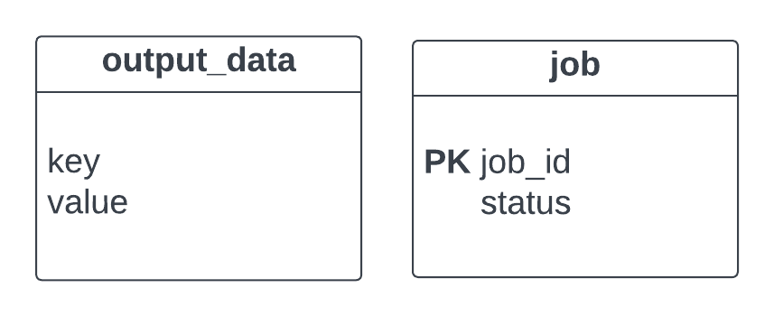

# Backend Interview README

## Part3 TransformCopyFlow
- ``value_dict`` type: type hint of [Node](../uniflow/node.py) shows that ``value_dict`` should be Mapping, but according to the code of batch and server_client result of ``TransformCopyFlow``, type of ``value_dict`` is actually a sequence of mapping. Nodes created by ``TransformCopyFlow`` are of type ``sequence of mapping``.

## Part4 Docker
##### INSTRUCTION: Building and Running the Docker Container

**1. Build the Docker Image:**

1. Open a terminal in the [directory](../).
2. Execute the following command to build the image:

   ```bash
   docker build -t my-uniflow-app .
   ```
   Replace ``my-uniflow-app`` with your desired image name.

**2. Run the Docker Container:**
1. Execute the following command to run the container:

    ```bash
    docker run -p 8080:5000 my-uniflow-app
    - This maps port 8080 on your host machine to port 5000 in the container.
    ```
## Part5 Kubernetes
##### INSTRUCTION: Deploying a Uniflow application Kubernetes Cluster
1. Save the YAML file
2. Deploy the application: Use kubectl to deploy:
    ```bash
    kubectl apply -f deployment.yaml
    ```
## Part6 Database
Implemented with Sqlite.


## Part7 API
Implemented with Flask.
##### INSTRUCTION: Running Flask API
1. Install dependencies: Make sure you have installed all the necessary Python libraries using ``pip install -r requirements.txt``.
2. Run the application: In the terminal, navigate to the [app directory](../app/) and run ``python app.py``.
3. Access the API endpoints: You can access the API endpoints defined in the code using tools like Postman or curl commands or front-end interface like React. There is a [sample bash code](../app/test/curl.sh) using curl to test the endpoints.


