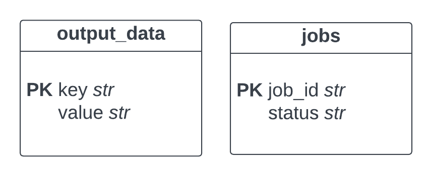

# Backend Interview README

## Part 3 ExpandReduceFlow
[ExpandReduceFlow](../uniflow/flow/transform/expand_reduce_flow.py) takes a batch of dictionaries as input. For each dictionary, it separates its key-value pairs into 2 folds with [ExpandOp](../uniflow/op/basic/expand_op.py) and then concatenate the key-value pairs having the same index in these 2 folds with [ReduceOp](../uniflow/op/basic/reduce_op.py). For instance, it would convert ``{1:a, 2:b, 3:c, 4:d}`` to ``{13:ac, 24:bd}``. In the case that the dictionary cannot be divided into 2 equal folds, the last key-value pair will stay the same after expand and reduce.

- [unit test](../tests/op/basic/test_expand_op.py) for ExpandOp.
- **TODO**: ``value_dict`` type is inconsistent in uniflow. ``TransformServer`` runs ``_divide_data_into_batches()`` which converts ``Mapping`` into ``Sequence of Mapping``, while the type hint of [Node](../uniflow/node.py) is ``Mapping``. Currently,``expand_reduce_flow`` assumes the input and output are ``Sequence of Mapping``.

## Part 4 Docker
[dockerfile](../dockerfile) is used to create a Docker image for a backend Flask client server application of ``expand-reduce-flow``.

[push_docker.sh](../push_docker.sh) automates a Build-Tag-Pull aproach to build a docker image and upload it to [Docker Hub](https://hub.docker.com/repository/docker/sherry0506/uniflow-expand-reduce/general).

##### Instruction: Building and Running the Docker Container

**1. Build the Docker Image:**

1. Open a terminal in the [directory](../).
2. Execute the following command to build the image:

   ```bash
   docker build -t uniflow-expand-reduce .
   ```
   Replace ``uniflow-expand-reduce`` with your desired image name.

**2. Run the Docker Container:**
1. Execute the following command to run the container:

    ```bash
    docker run -p 8080:5000 my-uniflow-app
    ```
    - This maps port 8080 on your host machine to port 5000 in the container.

## Part 5 Kubernetes
[deploment.yaml](../deployment.yaml) defines a Kubernetes Deployment and a Service for a Dockerized application.

- Deployment: The Deployment, named uniflow-deployment, manages a set of three replicas of Pods. The Pods run a Docker container with the image sherry0506/uniflow-expand-reduce:latest. The container listens on port 5000.

- Service: The Service, named uniflow-service, exposes the application on each node's IP at static port (NodePort) 30080. It routes traffic to TCP port 5000 of the Pods with the label app: uniflow.

##### Instruction: Deploying a Uniflow application Kubernetes Cluster
1. Start a Kubernetes cluster locally with Minikube or Kind, for example:
    ```bash
    minikube start
    ```
    or on cloud including GKE or Amazon EKS.
2. Deploy the application: Use kubectl to deploy:
    ```bash
    kubectl apply -f deployment.yaml
    ```
3. Verify that the deployment and service was created successfully.
    ```bash
   kubectl get deployments
   kubectl get services
    ```
Now, your application should be running on your Kubernetes cluster. You can access it using the IP address of your Kubernetes cluster and the port assigned to uniflow-service, for our deployment, the port is ``30080``.

## Part 6 Database
The [database](../uniflow/flow/database.py) is implemented with Sqlite and is thread-safe.

##### Singleton:
There is only one database instance and is shared among all threads. It enables the thread safety by protecting the database with the ``_lock`` in the database instance.

##### Thread-safe:
The functions that operate the database use ``with`` statement to acquire the lock and establish the connection. Then, they execute the database operations. Upon completions, the functions commit and release the lock. Upon crashes, the functions roll back and release the lock.

##### Limitation: 
The database file path (``uniflow_data.db``) is relative to the working directory and needs to be set with cautious when the working directory changes.

##### Schema
The ``output_data`` table stores all of the key-value pair generated by the ``expand_reduce_flow``. **For duplicated keys, only the latest value is stored in the database.** (need to confirm with the product team about the expected behaviour) The key-value pair is currently not associated with the job.

The ``jobs`` table stores the ``job_id`` and ``status``. The ``job_id`` is a random long string generated by the backend. The ``status`` is initially ``pending`` and becomes ``complete`` after the ``expand_reduce_flow`` completes.


## Part 7 Develop Client-Facing APIs
The backend is implemented with Flask.
##### Instruction
1. Run the backend: In the terminal, navigate to the [app directory](../app/) and run ``python app.py``.
2. Test the API: There is a [single-thread sample bash code](../app/test/single_thread.sh) and a [multi-thread sample bash code](../app/test/multi_thread.sh) using curl to test the API endpoints.

##### API Documentation

<details>
<summary><code>POST</code> <code><b>/flows/expand_reduce</b></code> <code>(starts a new expand_reduce_flow job)</code></summary>

##### Request Parameter
> | name     |  type      | data type      | description                                                  |
> |----------|------------|----------------|--------------------------------------------------------------|
> | None     |  required  | JSON           | list of dictionaries                                         |

Example cURL
> ```javascript
>  curl -H "Content-Type: application/json" --data @seebelow http://localhost:5000/flows/expand_reduce
> ```

Example of data:
```json
[
    {
        "key1": "value1",
        "key2": "value2"
    },
    {
        "key3": "value3",
        "key4": "value4"
    }
]
```

##### Response
> | http code     | content-type                      | response                                                            |
> |---------------|-----------------------------------|---------------------------------------------------------------------|
> | `202`         | `application/json`                | `{"job_id": string}`                                                |
> | `400`         | `application/json`                | `{"code":"400","message":"Bad request"}`                            |


```json
{
    "job_id": "123e4567-e89b-12d3-a456-426614174000"
}
```
</details>

<details>
 <summary><code>GET</code> <code><b>/flows/status/{job_id}</b></code> <code>(gets the status of a job)</code></summary>

##### Request Parameters

> | name     |  type      | data type      | description                                                  |
> |----------|------------|----------------|--------------------------------------------------------------|
> | `job_id` |  required  | string         | The id of the job to check                                   |

Example cURL
> ```javascript
>  curl -X GET -H "Content-Type: application/json" http://localhost:5000/flows/status/123e4567-e89b-12d3-a456-426614174000
> ```

##### Response

> | http code     | content-type                      | response                                                            |
> |---------------|-----------------------------------|---------------------------------------------------------------------|
> | `200`         | `application/json`                | `{"job_id": string, "status": string}`                              |
> | `404`         | `application/json`                | `{"code":"404","message":"Job not found"}`                          |

```json
{
    "job_id": "123e4567-e89b-12d3-a456-426614174000",
    "status": "completed"
}
```
</details>

<details>
 <summary><code>GET</code> <code><b>/flows/results</b></code> <code>(gets all results in the database)</code></summary>

##### Request Parameters

> | name    |  type      | data type      | description                                          |
> |---------|------------|----------------|------------------------------------------------------|
> | `page`  |  required  | int            | The page number                                      |
> | `limit` |  required  | int            | The maximum number of key-value pairs to return      |

Example cURL
> ```javascript
>  curl -X GET -H "Content-Type: application/json" http://localhost:5000/flows/results?page=1&limit=15
> ```

##### Response

> | http code     | content-type                      | response                                                            |
> |---------------|-----------------------------------|---------------------------------------------------------------------|
> | `200`         | `application/json`                | `{"results": dict, "total_pages": int)}`                            |
> | `400`         | `application/json`                | `{"code":"400","message":"Bad request"}`                            |

```json
{
    "results": {        
            "key1key3": "value1vlue3",
            "key2key4": "value2vlue4"
    }
    "total_pages": 1
}
```
</details>